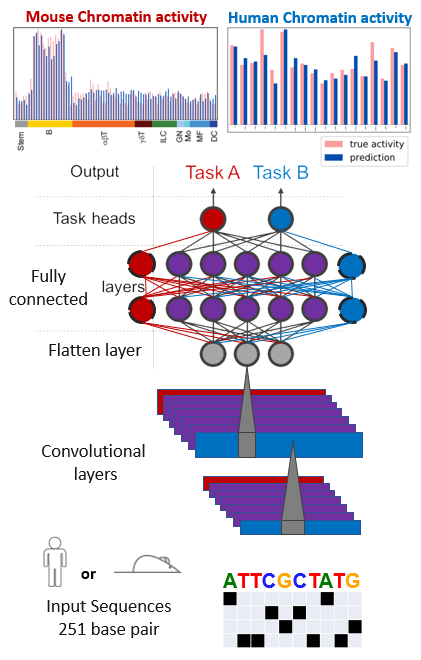

# multitask_species
Combine data from species/individuals/datatypes in a multitask framework

# Preprocessing the data
Run `proprocess_feature_data_interested_startpoint.py`

# Single species model learning
1. Run `model_learning.py` to train a model based on Basset architecture, with the changes of adding BN into Fully connected layers
2. Run `extract_motifs.py` to perform model interpretation
If want to generate figures: optionally run scripts in Folder [scripts_for_figures](https://github.com/ChendiWang/multitask_species/tree/master/scripts/scripts_for_figures)
3. Run ISM experiments using scripts in Folder [ism](https://github.com/ChendiWang/multitask_species/tree/master/scripts/ism)

# Multitask variants
1. `hard_split.py`
2. `soft_branch.py`
3. `hard_branch.py`
4. `transfer_learning.py`: if you want to compare performance to transfer learning 

# Partial pytorch version
Scripts are in Folder [partial_scripts_for_pytorch](https://github.com/ChendiWang/multitask_species/tree/master/scripts/partial_scripts_for_pytorch)

# Test run on Basset model
Scripts are in Folder [Basset](https://github.com/ChendiWang/multitask_species/tree/master/scripts/Basset)

# Architecture variants
1. Single task

2. Multitask Hard split 

3. Multitask Soft branch

4. Multitask Hard branch via task routing

